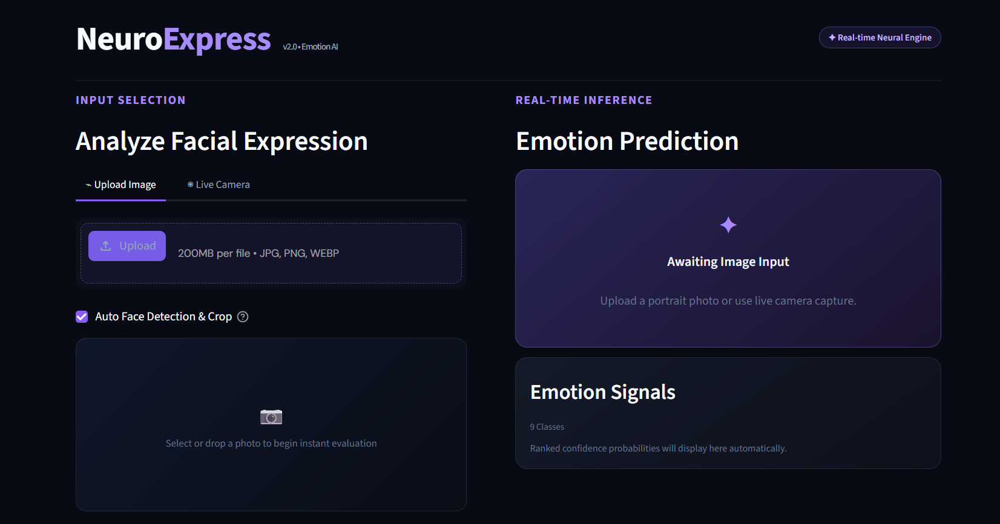

# NeuroExpress — Facial Emotion Recognition

NeuroExpress is a Streamlit web application for classifying facial expressions using a **ResNet50 + DenseNet121 soft-voting ensemble** model. It predicts one of nine emotion classes from a portrait image or a live camera capture, then presents the top result and a ranked confidence breakdown.

The application reproduces the preprocessing and label order from the training notebook, ensuring browser predictions are consistent with the trained model pipeline.

## Web App Preview



## Test Cases

### Happy Prediction


### Angry Prediction


## Features

- Photo upload for JPG, PNG, and WebP portraits
- Live camera capture directly in the browser
- Auto face detection and crop (Haar cascade) to isolate the face ROI
- Nine-class facial expression prediction
- Primary prediction with confidence score and inference time
- Ranked top-three emotion signals, with all remaining scores available on demand
- Clear analysis control for fast repeat testing
- Responsive dark interface for desktop and mobile use

## Emotion Classes

| Index | Model Class | Display Label | Emoji |
| ---: | --- | --- | :---: |
| 0 | Angry | Angry | 😠 |
| 1 | Anxiety | Anxiety | 😰 |
| 2 | Confusion | Confusion | 😕 |
| 3 | Disgust | Disgust | 🤢 |
| 4 | Fear | Fear | 😨 |
| 5 | Happy | Happy | 😄 |
| 6 | Neutral | Neutral | 😐 |
| 7 | Sad | Sad | 😢 |
| 8 | Suprise | Surprise | 😲 |

> The model was trained on a dataset directory named `Suprise`. The application preserves this internal class order to keep predictions correct, while displaying the standard spelling, **Surprise**, in the interface.

---

## Model Pipeline

The ensemble was trained in `Code.ipynb` using ImageNet-initialized **ResNet50** and **DenseNet121** backbones, each with a nine-class softmax output. At inference time, both models produce probability vectors which are averaged equally (soft voting, weight 0.5 each).

### Preprocessing Sequence

Every image passes through this pipeline before inference — identical to the training pipeline:

1. Resize to **96 × 96** RGB
2. **Gaussian Blur** with a `3 × 3` kernel (noise reduction)
3. **CLAHE** contrast enhancement in LAB color space (`clipLimit=2.0`, `tileGridSize=8×8`)
4. **Sharpening filter** using a `3 × 3` Laplacian kernel
5. Convert to `float32` and normalize pixels to `[0, 1]`

> **Important:** Do not replace this pipeline with a backbone-specific `preprocess_input` function unless the models are retrained using that function.

### Ensemble Inference

```
ensemble_probability = 0.5 × ResNet50_probs + 0.5 × DenseNet121_probs
predicted_class      = argmax(ensemble_probability)
```

---

## Model Performance Results

> Evaluated on a held-out test set of **976 samples** across 9 emotion classes.

### Summary — All Three Models

| Model | Accuracy | Precision (W) | Recall (W) | F1-Score (W) | Log Loss |
| --- | :---: | :---: | :---: | :---: | :---: |
| ResNet50 (fine-tuned) | 0.9416 | 0.9434 | 0.9416 | 0.9412 | 0.1442 |
| DenseNet121 (fine-tuned) | **0.9857** | **0.9871** | **0.9857** | **0.9858** | **0.0328** |
| **Ensemble (ResNet50 + DenseNet121)** | 0.9846 | 0.9850 | 0.9846 | 0.9847 | 0.0727 |

*(W = weighted average)*

---

### ResNet50 — Per-Class Results

| Class | Precision | Recall | F1-Score | Support |
| --- | :---: | :---: | :---: | :---: |
| Angry | 0.96 | 1.00 | 0.98 | 97 |
| Anxiety | 0.93 | 0.82 | 0.87 | 123 |
| Confusion | 0.89 | 1.00 | 0.94 | 112 |
| Disgust | 0.96 | 0.98 | 0.97 | 65 |
| Fear | 0.90 | 0.93 | 0.92 | 198 |
| Happy | 1.00 | 0.97 | 0.98 | 94 |
| Neutral | 0.99 | 0.95 | 0.97 | 132 |
| Sad | 0.92 | 0.99 | 0.95 | 80 |
| Surprise | 1.00 | 0.88 | 0.94 | 75 |
| **Macro avg** | **0.95** | **0.95** | **0.95** | **976** |
| **Weighted avg** | **0.94** | **0.94** | **0.94** | **976** |

---

### DenseNet121 — Per-Class Results

| Class | Precision | Recall | F1-Score | Support |
| --- | :---: | :---: | :---: | :---: |
| Angry | 1.00 | 1.00 | 1.00 | 97 |
| Anxiety | 0.90 | 1.00 | 0.95 | 123 |
| Confusion | 1.00 | 0.99 | 1.00 | 112 |
| Disgust | 1.00 | 1.00 | 1.00 | 65 |
| Fear | 1.00 | 0.94 | 0.97 | 198 |
| Happy | 1.00 | 0.99 | 0.99 | 94 |
| Neutral | 1.00 | 1.00 | 1.00 | 132 |
| Sad | 1.00 | 1.00 | 1.00 | 80 |
| Surprise | 1.00 | 1.00 | 1.00 | 75 |
| **Macro avg** | **0.99** | **0.99** | **0.99** | **976** |
| **Weighted avg** | **0.99** | **0.99** | **0.99** | **976** |

---

### Ensemble (ResNet50 + DenseNet121) — Per-Class Results

| Class | Precision | Recall | F1-Score | Support |
| --- | :---: | :---: | :---: | :---: |
| Angry | 0.99 | 1.00 | 0.99 | 97 |
| Anxiety | 0.92 | 0.97 | 0.94 | 123 |
| Confusion | 1.00 | 0.99 | 1.00 | 112 |
| Disgust | 1.00 | 1.00 | 1.00 | 65 |
| Fear | 0.98 | 0.95 | 0.97 | 198 |
| Happy | 1.00 | 0.99 | 0.99 | 94 |
| Neutral | 1.00 | 1.00 | 1.00 | 132 |
| Sad | 1.00 | 1.00 | 1.00 | 80 |
| Surprise | 1.00 | 1.00 | 1.00 | 75 |
| **Macro avg** | **0.99** | **0.99** | **0.99** | **976** |
| **Weighted avg** | **0.99** | **0.98** | **0.98** | **976** |

---

## Project Structure

```text
Human-Facial-Expression-Recognition-Using-Deep-Learning-and-Computer-Vision-Techniques/
├── .streamlit/
│   └── config.toml                     # Production dark-theme configuration
├── models/
│   ├── resnet50_finetuned.keras         # Fine-tuned ResNet50 model (~217 MB)
│   ├── densenet121_finetuned.keras      # Fine-tuned DenseNet121 model (~92 MB)
│   ├── ensemble_config.json             # Ensemble metadata (weights, image size, classes)
│   ├── class_names.json                 # Ordered list of 9 emotion class names
│   └── model_info.txt                   # Human-readable ensemble summary
├── assets/
│   ├── ui.png                            # Web application preview
│   ├── Happy Test Case.png               # Happy prediction example
│   └── Angry Test Case.png               # Angry prediction example
├── app.py                               # Streamlit application (ensemble inference)
├── training_notebook.ipynb              # Training, evaluation, and export notebook
├── requirements.txt                     # Python dependencies
└── README.md
```

---

## Run Locally

### 1. Create and activate a virtual environment

```bash
python -m venv .venv
```

**Windows PowerShell**

```powershell
.\.venv\Scripts\Activate.ps1
```

### 2. Install dependencies

```bash
pip install -r requirements.txt
```

### 3. Start the app

```bash
streamlit run app.py
```

Open the local URL shown in the terminal. For live camera mode, grant the browser permission to use your camera.

---

## Deployment Notes

The two model files total approximately **309 MB**, which exceeds GitHub's standard 100 MB file limit. Before deploying, choose one of these options:

- Store the models using **Git LFS**.
- Store the models in cloud object storage and download them securely when the app starts.
- Deploy with Docker or another platform that allows large model artifacts outside a standard GitHub push.

For Streamlit Community Cloud, keep `app.py`, `requirements.txt`, and `.streamlit/config.toml` in the repository. Ensure the deployed environment can access the `models/` directory through one of the approaches above.

### Required production model setup

When both artifacts are available, every result is the equal-weight ResNet50 +
DenseNet121 ensemble. DenseNet121 is the required fallback: if ResNet50 is
missing or invalid, the interface clearly reports that it is using DenseNet121
only. It never serves a ResNet50-only prediction. This repository includes Git
LFS rules for both artifacts; from this project directory, before committing
or pushing, run:

```bash
git lfs install
git add .gitattributes models/resnet50_finetuned.keras models/densenet121_finetuned.keras
git commit -m "Store ensemble models with Git LFS"
git push
```

In Streamlit Community Cloud, set the app's entry point to `app.py` in this
project directory. At startup the app resolves model paths relative to
`app.py` and validates models' input/output shapes. It stops with an error
when DenseNet121 is missing or invalid.

---

## Responsible Use

NeuroExpress is a demonstration and research project. Facial-expression classification is probabilistic and can be affected by lighting, pose, image quality, demographic variation, and dataset limitations. It must not be used for medical, psychological, employment, security, or other high-impact decisions.

**Web App:** [neuroexpress-facial-emotion](https://neuroexpress-facial-emotion.streamlit.app/)
